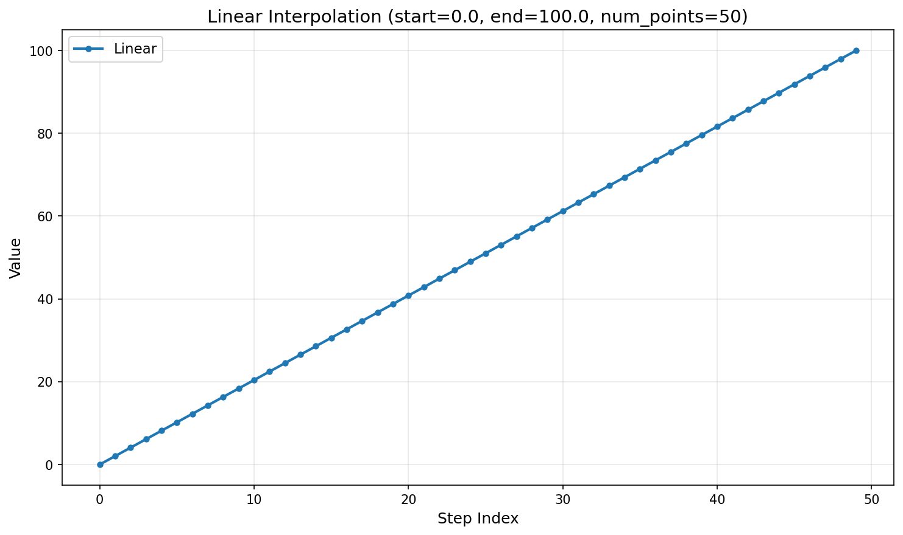
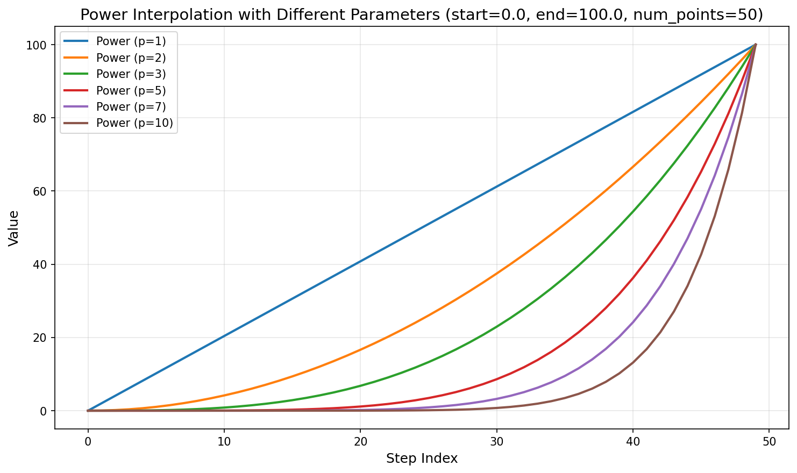
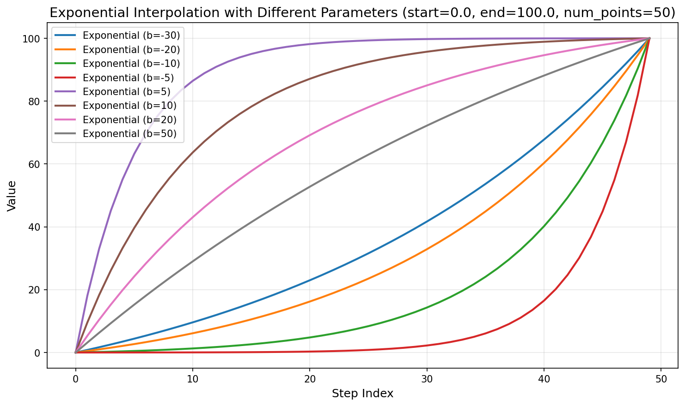
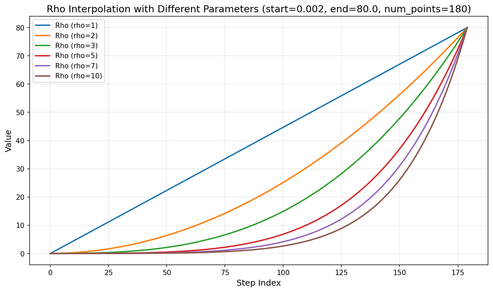
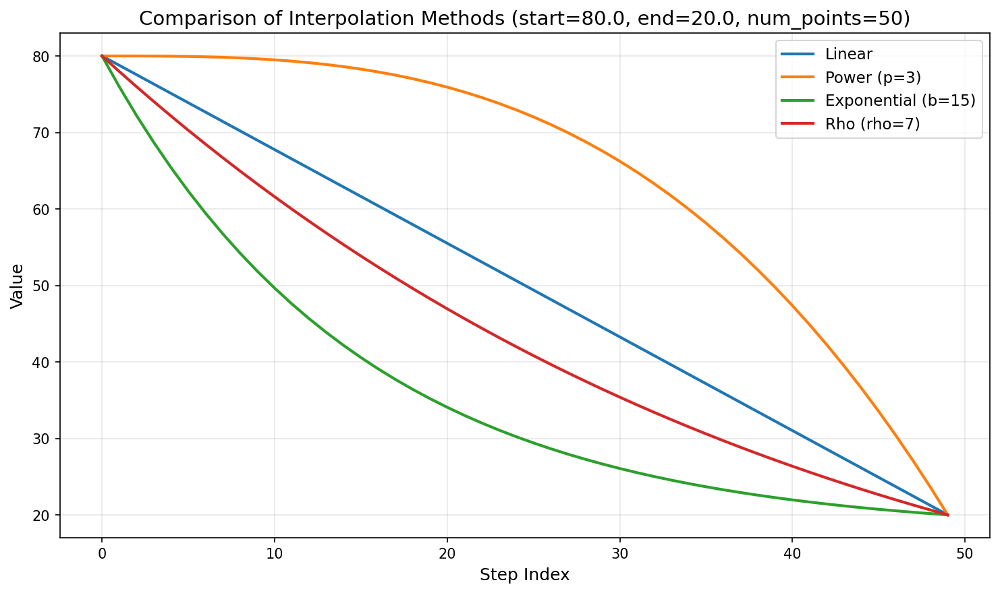

# Flexible Interpolator

[](https://www.python.org/downloads/)

A flexible Python library for generating intermediate points between start and end values using various interpolation methods. Perfect for noise scheduling in diffusion models, parameter tuning, and any scenario requiring non-linear interpolation schemes.

This code is provided freely for public use without any license restrictions.

## Features

- 🎯 **Multiple Interpolation Methods**: Linear, Power-based, Exponential, Rho-based, and Geometric
- 🚀 **Easy to Use**: Simple API with both class-based and function-based interfaces
- 🔧 **Flexible**: Adjustable parameters for fine-tuning each method
- 📊 **Visualization Support**: Built-in plotting capabilities and CLI tool
- 🎨 **PyTorch Compatible**: Native PyTorch tensor support
- 📦 **Lightweight**: Minimal dependencies
- 💻 **Command-Line Interface**: Generate plots directly from the command line

## Installation

This library can be used directly by importing the `interpolator.py` file. Simply ensure you have the required dependencies installed:

```bash
pip install torch matplotlib numpy
```

Or install all dependencies from requirements.txt:

```bash
pip install -r requirements.txt
```

Then you can directly import and use the interpolator in your Python scripts:

```python
from interpolator import Interpolator
```

## Quick Start

### Basic Usage

```python
from interpolator import Interpolator

# Create an interpolator instance
interp = Interpolator(start=0.0, end=1.0, num_points=10)

# Linear interpolation
linear_values = interp.linear()

# Power-based interpolation
power_values = interp.power(p=3)

# Exponential interpolation
exp_values = interp.exponential(b=2.0)

# Rho-based interpolation
rho_values = interp.rho(rho=7)
```

### Using the Unified Interface

```python
# All methods through one interface
interp = Interpolator(start=0.002, end=80.0, num_points=180)

linear = interp.interpolate("linear")
power = interp.interpolate("power", p=3)
exponential = interp.interpolate("exponential", b=28.8)
rho = interp.interpolate("rho", rho=7, include_zero=False)
geometric = interp.interpolate("geometric")
```

### Convenience Function

```python
from interpolator import interpolate

# Quick interpolation without creating a class
values = interpolate(start=0, end=100, num_points=5, method="linear")
```

### Get All Methods at Once

```python
interp = Interpolator(start=0.002, end=80.0, num_points=180)
all_results = interp.get_all_methods(p=3, rho=7, include_zero=False)

# Access results
linear = all_results['linear']
power = all_results['power']
exponential = all_results['exponential']
rho = all_results['rho']
geometric = all_results['geometric']
```

### Command-Line Interface

The `interpolate.py` script provides a command-line interface for generating interpolation plots:

```bash
python interpolate.py --method METHOD --start START --end END --num-points N [OPTIONS]
```

**Required Arguments:**
- `--method`: Interpolation method (`linear`, `power`, `exponential`, `rho`, `geometric`)
- `--start`: Starting value for interpolation
- `--end`: Ending value for interpolation
- `--num-points`: Total number of output points

**Optional Arguments:**
- `--output`: Output filename (auto-generated if not provided)
- `--p`: Power parameter for power method (default: 3)
- `--b`: Exponential rate parameter for exponential method (default: auto-calculated)
- `--rho`: Rho parameter for rho method (default: 7)
- `--include-zero`: Include zero in rho method
- `--dpi`: Resolution for output image (default: 150)

**Examples:**

```bash
# Linear interpolation
python interpolate.py --method linear --start 0.0 --end 100.0 --num-points 50

# Power interpolation with custom parameter
python interpolate.py --method power --start 0.0 --end 100.0 --num-points 50 --p 5

# Exponential interpolation
python interpolate.py --method exponential --start 0.0 --end 100.0 --num-points 50 --b 15

# Rho interpolation
python interpolate.py --method rho --start 0.002 --end 80.0 --num-points 180 --rho 7

# Geometric interpolation
python interpolate.py --method geometric --start 0.0 --end 100.0 --num-points 50
```

## Interpolation Methods

### 1. Linear Interpolation

The simplest method that creates equally spaced points between start and end.

```python
values = interp.linear()
```

**Mathematical Formula:**

For output length $n$ (num_points), the interpolated values are:

$$t_i = \text{start} + (\text{end} - \text{start}) \cdot \frac{i}{n-1}$$

where $i \in \{0, 1, 2, \ldots, n-1\}$ and $n > 1$. When $n = 1$, $t_0 = \text{start}$.

**Characteristics:**
- Uniform distribution
- Equal step sizes
- Straight line from start to end



### 2. Power-based Interpolation

Creates non-linear interpolation with adjustable power parameter `p`.

```python
values = interp.power(p=3)
```

**Mathematical Formula:**

For output length $n$ (num_points) and power parameter $p$:

$$t_i = \text{start} + (\text{end} - \text{start}) \cdot \left(\frac{i}{n-1}\right)^p$$

where $i \in \{0, 1, 2, \ldots, n-1\}$ and $n > 1$. When $n = 1$, $t_0 = \text{start}$.

This formula creates a non-linear curve where the distribution depends on the power parameter $p$.

**Parameters:**
- `p` (float): Power parameter controlling curve shape
  - Higher `p` (p > 1): More concentration at start
  - Lower `p` (0 < p < 1): More concentration at end
  - `p = 1`: Linear interpolation
  - Must be positive

**Use Cases:**
- When you need more samples near start/end
- Non-uniform sampling strategies



### 3. Exponential Interpolation

Exponential decay from start to end, useful when you need more steps at the beginning.

```python
values = interp.exponential(b=28.8)
```

**Mathematical Formula:**

For output length $n$ (num_points) and exponential rate parameter $b$:

$$t_i = \text{start} + (\text{end} - \text{start}) \cdot \left(1 - \frac{\exp\left(\frac{n-1 - i}{b}\right) - 1}{\exp\left(\frac{n-1}{b}\right) - 1}\right)$$

where $i \in \{0, 1, 2, \ldots, n-1\}$, $n > 1$, and $b \neq 0$. When $n = 1$, $t_0 = \text{start}$.

The default value for $b$ is $(n-1) \cdot 0.16$.

This formula creates an exponential decay that concentrates more points near the start value, with the spacing increasing as we approach the end.

**Parameters:**
- `b` (float): Exponential rate parameter (default: `(num_points - 1) * 0.16`)
  - Higher `b`: Slower decay, more gradual transition
  - Lower `b`: Faster decay, more concentration at start
  - Must be non-zero (can be positive or negative)

**Use Cases:**
- Diffusion model noise scheduling
- Learning rate scheduling
- Annealing schedules



### 4. Rho-based Interpolation

Power transformation-based interpolation commonly used in diffusion models.

```python
values = interp.rho(rho=7, include_zero=False)
```

**Mathematical Formula:**

For output length $n$ (num_points) and rho parameter $\rho$:

$$t_i = \left( \text{start}^{1/\rho} + \frac{i}{n-1} \cdot \left(\text{end}^{1/\rho} - \text{start}^{1/\rho}\right) \right)^\rho$$

where $i \in \{0, 1, 2, \ldots, n-1\}$ and $n > 1$. When $n = 1$, $t_0 = \text{start}$.

If `include_zero=True`, then $t_{n-1} = 0$ (the last point is replaced with zero).

**Parameters:**
- `rho` (float): Rho parameter controlling curve shape (default: 7)
  - Must be positive and non-zero
- `include_zero` (bool): If True, replaces the last point with zero (default: False)
  - Requires both start and end to be non-negative

**Use Cases:**
- Diffusion model noise schedules
- Score-based generative models
- Advanced scheduling strategies



### 5. Geometric Interpolation

Geometric progression-based interpolation using exponential scaling.

```python
values = interp.geometric()
```

**Mathematical Formula:**

For output length $n$ (num_points), the interpolated values are:

$$t_i = \text{start} \cdot \left(\frac{\text{end}}{\text{start}}\right)^{\frac{i}{n-1}}$$

where $i \in \{0, 1, 2, \ldots, n-1\}$ and $n > 1$. When $n = 1$, $t_0 = \text{start}$.

This formula creates a geometric progression where:
- When $i = 0$: $t_0 = \text{start} \cdot \left(\frac{\text{end}}{\text{start}}\right)^0 = \text{start}$
- When $i = n-1$: $t_{n-1} = \text{start} \cdot \left(\frac{\text{end}}{\text{start}}\right)^1 = \text{end}$

**Constraints:**
- `start` must be non-zero (division by zero)
- `start` and `end` must have the same sign (both positive or both negative)

**Characteristics:**
- Exponential scaling based on the ratio end/start
- More concentration at start when end/start > 1
- More concentration at end when end/start < 1
- Constant ratio between consecutive values

**Use Cases:**
- Geometric sequences and progressions
- Exponential growth/decay modeling
- Multiplicative scaling scenarios
- When you need constant ratio between steps

## Comparison

### All Methods Comparison (Ascending)

When start < end, all methods interpolate from the lower value to the higher value.

**Settings:**
- Start: 20.0
- End: 80.0
- Number of points: 50
- Methods: Linear, Power (p=3), Exponential (b=15), Rho (rho=7), Geometric


### All Methods Comparison (Descending)

When start > end, all methods interpolate from the higher value to the lower value.

**Settings:**
- Start: 80.0
- End: 20.0
- Number of points: 50
- Methods: Linear, Power (p=3), Exponential (b=15), Rho (rho=7), Geometric



## Requirements

- Python 3.7+
- PyTorch >= 1.9.0
- NumPy >= 1.19.0
- Matplotlib >= 3.3.0 (for visualization)

## Use Cases

- **Diffusion Models**: Noise scheduling and time step generation
- **Score-based Models**: Noise level scheduling
- **Parameter Tuning**: Non-uniform parameter search spaces
- **Animation**: Smooth transitions between keyframes
- **Signal Processing**: Time-varying parameter generation
- **Machine Learning**: Learning rate scheduling, temperature annealing

## Project Structure

```
flexible-interpolator/
├── interpolator.py      # Main interpolation library
├── interpolate.py       # Command-line interface
├── plotting.py          # Plotting utilities
├── example.py           # Example usage scripts
├── requirements.txt     # Dependencies
├── README.md           # This file
├── docs/               # Documentation images
│   ├── linear_interpolation.png
│   ├── power_interpolation_multiple_params.png
│   ├── exponential_interpolation_multiple_params.png
│   ├── rho_interpolation_multiple_params.png
│   ├── all_methods_comparison_ascending.png
│   └── all_methods_comparison_descending.png
└── outputs/            # Generated output files (gitignored)
```

## Contributing

Contributions are welcome! Please feel free to submit a Pull Request.

## License

This code is provided freely for public use without any license restrictions. Use it as you wish!

## Acknowledgments

This library was inspired by interpolation schemes commonly used in diffusion models and score-based generative models.

## Support

For issues, questions, or contributions, please open an issue on GitHub.
